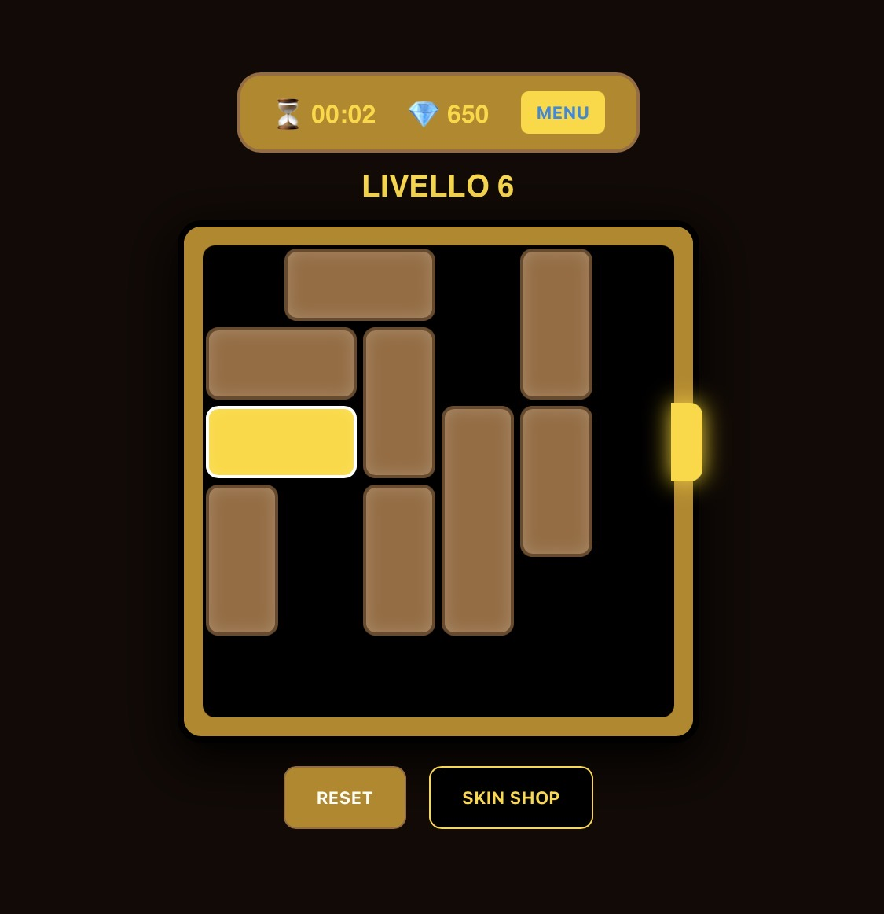

# MasterKey

MasterKey è un puzzle game basato su movimento di blocchi in una griglia, dove l’obiettivo è liberare la chiave e raggiungere l’uscita. Ogni livello aumenta di difficoltà e introduce una struttura sempre più complessa.

Il gioco include:
- 100 livelli progressivi generati proceduralmente
- Sistema di generazione livelli con verifica di solvibilità
- Drag & drop dei blocchi con movimento vincolato
- Blocco “chiave” con obiettivo di uscita
- Sistema XP e progressione livelli salvata in localStorage
- Skin system (default, neon, royal, ecc.)
- Skin shop con acquisto tramite XP
- Timer per ogni livello
- Menu livelli con sblocco progressivo
- Victory screen con ricompense

Il gioco fa parte della collection MasterHub:
https://mastersabba.github.io/MasterSabba/

